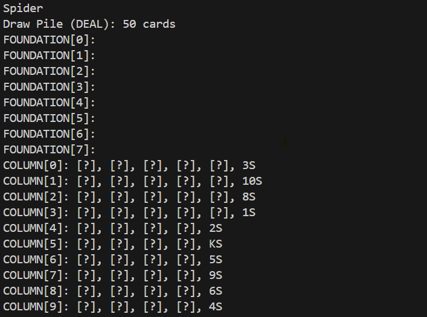
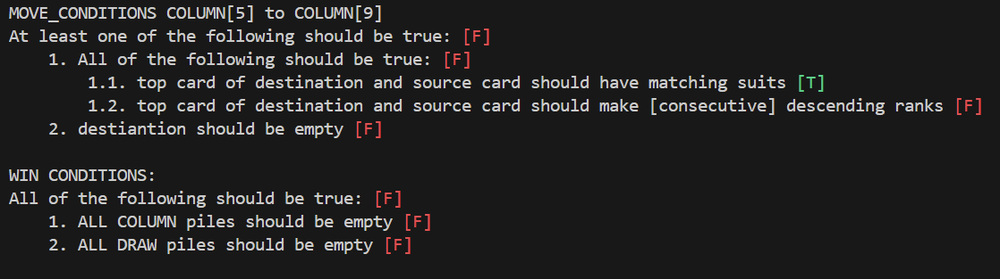
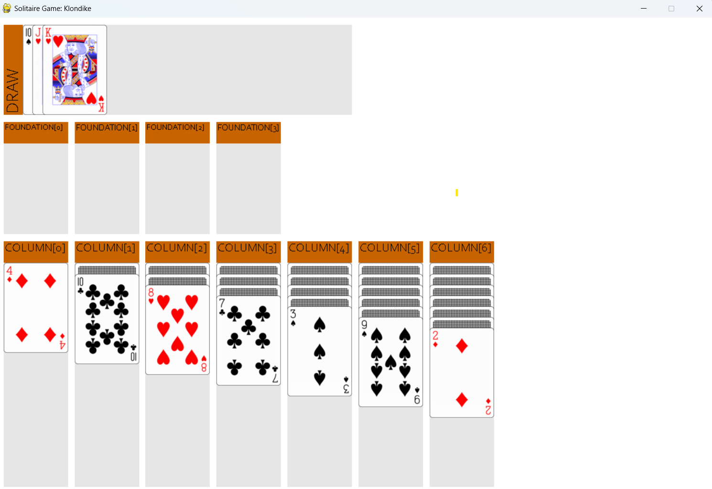

# Solitaire Game Description Language (SGDL)

The code and dataset available here are part of the research presented in "LLM Game Rule Understanding through Out-of-Distribution Fine-Tuning" by Bahar Bateni, Benjamin Pratt and Jim Whitehead, published at the 21st AAAI Conference on Artificial Intelligence and Interactive Digital Entertainment (AIIDE), 2025. The paper explortes the evaluation and improvement of rule-understanding abilities of large language models (LLMs) using multiple variants of Solitaire card games as testbeds. Despite the simplicity of rules, these games have numerous variations, each played very differently, making them ideal for our research questions. For more detail about our motivation and results, please refer to the paper available here (link to be added later).

## Overview

Our work on this research includes multiple components, spread across **different sources**.
1. The Solitaire framework in <ins>**the current repository**</ins> allows for creating and simulating many different variants using a custom Solitaire Game Description Langauge (SGDL) for defining the rules. This allows for:
     * **Playing** Solitaire variants based on the rules encoded in the GDL, either through the terminal or a custom GUI
     * **Modifying the rules** by changing the GDL
     * **Simulating** gameplay using the available general game-playing agents
     * **Creating datasets** by sampling during simulation
2. A [second repository](https://github.com/iambb5445/SolitaireLLMBenchmark) contains code for using the datasets created with this framework for testing and training Large Language Models.
3. Datasets used in the paper are included both on [huggingface](https://huggingface.co/datasets/bbateni/Solitaire-Rule-Reasoning-Benchmark) and [github](https://github.com/iambb5445/SolitaireLLMBenchmark/tree/main/dataset).
4. Finally, we created [a web version of our Solitaire framework](https://iambb5445.github.io/SolitaireGDLWeb/index.html). Note that this version only allows for playing games and modifying game rules by changing the underlying SGDL, but does not provde a way to simulate the game using bots or create datasets.


The code in this repository is for the Solitaire framework allowing for creating playable Solitaire games based on an SGDL. The code includes game logic, SGDL parsing and validation, game playing bots capable of playing with any generated game, and dataset creation. Below we provide more information and instructions for each of these components.

## Playing Games

### Requirements

Libraries requires for running the code in this repository can be found in [requirements.txt](requirements.txt). To install all of the requirements, use:

```shell
pip install -r requirements.txt
```

Using a virtual environment is recommended, but not required.

### Playing through the Terminal

<!-- <p align="center">
  
  
</p> -->

<!-- 
 -->


To play a solitaire game through terminal commands, use:

```shell
usage: run_cmd.py [-h] [--partial-info] filename [seed]

positional arguments:
  filename        Name of the SGDL file defining game rules. Refer to games/ for examples.
  seed            Integer seed to be used for shuffling the deck.

options:
  -h, --help      show this help message and exit
  --partial-info  Show only the cards that are faced up. Face down cards will be shown as [?]       
# e.g.
# python run_cmd.py games\spider_family\spider.sgdl 42
```

Note that filename refers to the sgdl file defining the game rules. You can use one of the available presets in the [games directory](games), or use your own.

The state of the game will be printed in the terminal, and the list of valid moves at the current state will be displayed. To play the game, you can either type the desired move (which might be invalid), or type the index of the move from the list of displayed moves.

<p align="center">
  
</p>

Whenever a move is attempted, a full summary of its conditions is displayed, showing whether or not each subcondition is true or false. If the move is finally valid, it will be performed. Otherwise, the game continues from the current state.

Additionally, a summary of the win condition will be displayed after every move.

<p align="center">
  
</p>

### Play through GUI

A simple gui is implemented in `gui.py` which can be used to visualize and play any described game. Note that due to the dynamic generation of gui, the placement of elements are not always perfect.



To play the game using the GUI, you can run:

```shell
usage: gui.py [-h] filename [seed]

positional arguments:
  filename    Name of the SGDL file defining game rules. Refer to games/ for examples.
  seed        Integer seed to be used for shuffling the deck.

options:
  -h, --help  show this help message and exit
# e.g.
# python gui.py games\spider_family\spider.sgdl 42
# python gui.py games\klondike_family\klondike.sgdl 42
```

The gui uses the `pygame` library, so ensure that `pygame` is installed before running the GUI. `pygame` is included in the requirements, but can be directly installed using:

```shell
pip install pygame
```

Upon running the gui, a visual representation of the current game state will be displayed. The cards can be dragged to perform a `MOVE`. A `MOVE_STACK` can be performed by moving the top card of the stack to a new position. Note that no animations are supported, so the visuals will change only if the move is valid. The terminal output shows useful information such as why the move was or was not valid, and what are the possible valid actions in this state.
Finally, a `DRAW` action is done **by clicking on the `Draw` label** next to the draw pile, not clicking on the cards in the draw pile. `DRAW` is only supported if the draw pile exists and if the draw action is valid.

The game ends and the window is closed or when a win condition is reached. When any move is attempted, valid or invalid, a full summary of its conditions will be printed in the terminal. Additionally, the list of all valid moves and a summary of the win conditions is also displayed after every move.

### Play through Web-App

The same GUI is also availabe as a web-based application available [here](https://iambb5445.github.io/SolitaireGDLWeb/index.html). Loading the game may take a few seconds. Using this version, you can:
* Play the game. Similar to the GUI, you can do this by drag and dropping cards, or clicking on the `Draw` label (again, not the cards in the `Draw` pile)
* View the terminal output on the right side, including list of available moves, reasoning for the performed action being valid/invalid, and win condition summary in the current state.
* Restart and change the seed using the `Reset` button
* Change the rules using the `Edit GDL` button. This will open the editor to change the game rules using the SGDL format. The current rules will be displayed in the terminal. Existing presets can be loaded, and download/upload is available. If the SGDL is invalid, the errors will be shown in the terminal when submitted and the game won't start.
* View game rules and more using the `info` button. The game description shown in the grey box is an automatically generated text describing the game. By changing the GDL and restarting the game, this description will automatically update.

## Simulation using Bots

### Bots and Heuristics

The bots and heuristics are defined in [`player.py`](player.py).

To implement a new bot, you have to define a class inheriting from `Player` and implement the `decide_action` function. Given a state, this function returns a string representing the action. The state includes all the information about both game rules (e.g. list of actions and conditions for each) and the current state (e.g. list of cards, piles, position of cards, etc.). Additionally, you can use the same object to get list of valid action (see `_get_actions`), get the list of valid actions and resulting state for each (see `_get_state_actions`), validate one action, test what would happen if the action is performed (see `_get_performed_state`), and more. If your bot inherits from `NoRepeatPlayer`, it can use `_register_state` at the start of `decide_action` and get the list of actions that only lead to unvisited states using `_get_new_state_actions`. See examples in `RandomNoRepeatPlayer` and `DFSPlayer`.

Existing bots includes:
* `RandomPlayer`: Performs a random action. Can be given a heuristic that gives weights to these actions.
* `RandomNoRepeatPlayer`: Performs a random action, but avoids action that lead to states that it has seen before.
* `DFSPlayer`: Performs the first action in the list. The actions are sorted by the heuristic, if any was given to it.

Some of the bots use heuristics. Heuristic is anything that inherits from `StateEval` and implements `get_value`. Given an action and the resulting state from that action, this function returns a value for the action. This value should be positive and in some range, which is set by calling `super` in the constructor. Some existing heuristics are:
* `WinHeuristic`: if the state is win, the action has the highest value (1), otherwise 0.
* `NoDrawHeuristic`: if the action is not `Draw`, it has the highest value (1), otherwise 0.
* `ActionCountHeuristic`: returns the number of actions that are available in the resulting state. The idea is to avoid dead ends by performing actions that keep the options open.
* `MergedHeuristic`: allows for combining any heuristics, possibly with different weights.
* `SpiderHeuristic`: experimental heuristic that is designed specifically for the game `spider`.

In the experiments presented in the paper, we use the DFS agent, since it tends to both decide quick and win faster, even compared to the experimental `MCTSPlayer`. We used the merged heuristic for 1 part `ActionCountHeuristic`, 1 part `NoDrawHeuristic`, 3 parts `WinHeuristic` (to make sure it can overrule the other two and win the game instantly if possible).

### One Round Simulation

To have a bot play the game, use the following command:

```shell
usage: simulate.py [-h] [--bot BOT] [--bot-seed BOT_SEED] [--partial-info] filename [seed]

positional arguments:
  filename             Name of the SGDL file defining game rules. Refer to games/ for examples.     
  seed                 Integer seed to be used for shuffling the deck.

options:
  -h, --help           show this help message and exit
  --bot BOT            Choose the bot to play the game. Options are: dict_keys(['random', 'random-  
                       no-repeat', 'dfs', 'dfs-heuristic'])
  --bot-seed BOT_SEED  Choose the bot to play the game. Options are: dict_keys(['random', 'random-  
                       no-repeat', 'dfs', 'dfs-heuristic'])
  --partial-info       Show only the cards that are faced up. Face down cards will be shown as [?].
```

This will run a single bot on a single game, and will log all the state and actions taken at all times. This is mostly to test bots in case you want to add new bots or new heuristics. However, to use the simulations properly, we simulate many instances and sample these simulations to create datasets. See the next section.

### Dataset Generation

As the paper describes with detail, we choose to create game progression questions. These questions are: given a state and an action, is the action valid? why? and what is the next state?

To create datasets for these questions, we simulate 100 games, each up to 2000 moves, and from all the visited states, we sample 1000. We also enable backtracking, so if the bot reaches a state with no actions (or when all actions result in a previously visited state for a no-repeat bot), we continue from the latest previous state that has possible actions. This process is implemented, to run games in parallel, in `simulate_many.py`:

```shell
usage: simulate_many.py [-h] [--bot BOT] [--sampling-seed SAMPLING_SEED] [--game-seed GAME_SEED]
                        [--max-moves MAX_MOVES] [--max-count MAX_COUNT] [--game-count GAME_COUNT]   
                        [--sampling-rate SAMPLING_RATE]
                        [--invalid-action-rate INVALID_ACTION_RATE]
                        [--bot-action-rate BOT_ACTION_RATE] [--thread-count THREAD_COUNT]
                        filename

We have intentionally chosen default values that will ensure a fast response. For creating
balanced datasets, these default values should be changed.

positional arguments:
  filename              Name of the SGDL file defining game rules. Refer to games/ for examples.    

options:
  -h, --help            show this help message and exit
  --bot BOT             Choose the bot to play the game. Options are: dict_keys(['random',
                        'random-no-repeat', 'dfs', 'dfs-heuristic'])
  --sampling-seed SAMPLING_SEED
                        Integer seed to be used for choosing the samples, random by default.        
  --game-seed GAME_SEED
                        Integer seed to be used for shuffling the games, random by default.
  --max-moves MAX_MOVES
                        Maximum number of moves in a game before stopping the sampling process      
                        (per game). Set to None using the code to continue until exhausting all     
                        the states the bot can reach.
  --max-count MAX_COUNT
                        Maximum number of samples to save in the dataset. Set to None using the     
                        code save all the sampled states.
  --game-count GAME_COUNT
                        Number of games to play.
  --sampling-rate SAMPLING_RATE
                        Rate of sampling (between 0 and 1). While you can directly set the number   
                        of samples by using max-count, not sampling all games can save memory.      
  --invalid-action-rate INVALID_ACTION_RATE
                        Rate of invalid actions to sample. Default is 0.5 to have a balanced        
                        dataset between valid/invalid responses.
  --bot-action-rate BOT_ACTION_RATE
                        Rate of bot actoins to sample (between 0 and 1). We avoid bias, we don't    
                        want to always (or ever) sample bot actions when choosing a valid action.   
  --thread-count THREAD_COUNT
                        Number of threads to run the simulation.
```
For the arguments, note that we have intentionally lowered the **default values** for a **lower scale simulation** (lower number of moves, games, etc.) to ensure the simulation will be performed fast. To create useful and balanced datasets these values should be chosen more carefully.

After running a simulation, the terminal show win percentage of the bots (out of number of games played), number of moves performed in each game (before exhausting all reachable state, winning, or reaching the maximum number of moves), average move count, how long was the simulation, and finally where the dataset is saved.

## Solitaire Game Description Language (SGDL)

To describe a game of solitiare, a `sgdl` file format is used. This file should follow SGDL grammar rules. For more information, refer to [the SGDL documentation](SGDL_Grammar.md).

Existing GDLs are available in the [games](games) directory.
